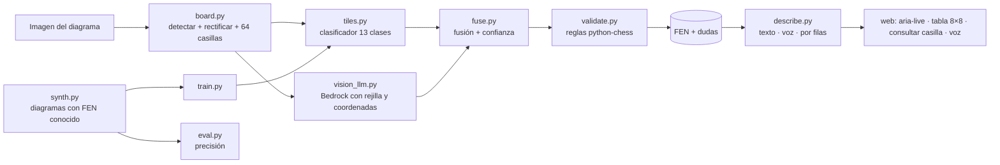

# Design Document

## Overview
Pipeline híbrido y medible: visión clásica + clasificador propio entrenado con diagramas sintéticos, LLM multimodal como segunda opinión, validación con reglas del ajedrez y traducción determinista a notación accesible.

## Architecture

## Paso 1 · Modelado
- Entrada: imagen con un diagrama 2D (impreso o digital). Fuera de alcance v1: fotos de tableros físicos en 3D.
- Salida: `Position = { fen, side_to_move, squares: {sq: piece|None}, confidence: {sq: float}, doubts: [sq] }`.
- Clases de casilla: `empty, wK, wQ, wR, wB, wN, wP, bK, bQ, bR, bB, bN, bP`.

## Paso 2 · Reconocimiento
1. **board.py:** escala de grises → umbral adaptativo → contornos → mayor cuadrilátero ≈ cuadrado → `warpPerspective` a 512×512. Si falla, fallback: proyecciones horizontales/verticales para encontrar las 9 líneas de la rejilla. Recorte con margen interior del 8 % por casilla.
2. **tiles.py:** características = casilla 32×32 normalizada + HOG. Clasificador `SVC(probability=True)` o `KNeighbors`. Vacía vs. ocupada con comparación a plantillas de casilla vacía clara/oscura (soporta rayado).
3. **synth.py:** FEN aleatorios plausibles y de partidas reales → `chess.svg.board(coordinates=random)` → PNG con tamaños 200–800 px, desenfoque, ruido, JPEG, rayado en oscuras.
4. **vision_llm.py:** dibuja rejilla y etiquetas a–h/1–8 sobre la imagen rectificada y pide JSON de casillas ocupadas. `temperature=0`.
5. **fuse.py:** acuerdo → confianza alta; desacuerdo → mayor probabilidad + "duda".
6. **validate.py:** reglas del Requirement 3.

## Paso 3 · Traducción accesible
- **describe.py:** `describe(fen, mode="compact"|"spoken"|"ranks", doubts=[])` — puro, determinista, 100 % testeado.
- Web: resumen en `aria-live`, tabla 8×8 accesible, consultar casilla, botones de voz, copiar FEN, tablero girado, selector de turno.

## API
- `POST /api/recognize` multipart `image`, `flipped?`, `turn?` → `{ fen, doubts, confidence, description: {compact, spoken, ranks}, source: "classifier"|"fused" }`
- `POST /api/describe` `{ fen, turn? }` → `{ description }`

## Medición (para "viabilidad técnica" y "uso de Kiro")
`eval.py` imprime: precisión por casilla, % tableros perfectos, matriz de confusión de piezas. Se registra cada iteración en `KIRO-LOG.md`.

## Riesgos y plan B
| Riesgo | Plan B |
|---|---|
| Estilo de piezas de los diagramas reales distinto al sintético | Añadir 20–30 casillas recortadas de `samples/` al entrenamiento; peso extra al LLM |
| Detección del tablero falla | Pedir recorte manual (el usuario sube solo el diagrama) + fallback por proyecciones |
| Sin AWS | Solo clasificador; decirlo en el pitch como "integración preparada" |
